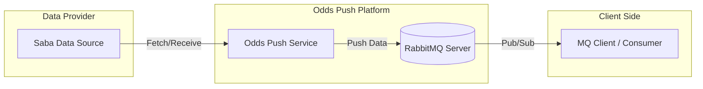
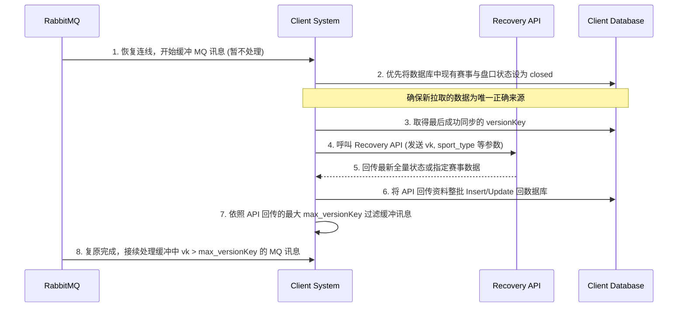

# 简介 (Introduction)

## 1. 文件目的 (Document Purpose)

本文件旨在为开发者提供一份详尽的技术指南，说明如何透过 OddsPush 平台整合并接收即时体育赛事与赔率资料。

1. 基于 RabbitMQ 的讯息发布/订阅机制，确保能以毫秒级的延迟接收赛事异动（如比分、开关盘）与赔率更新。
2. 详细定义核心对象结构减少在资料解析与业务逻辑对齐上的摸索时间
3. 可靠的整合流程, 提供关于讯息顺序性、版本检核及断线重连等最佳实践，确保下游系统在面对高併发流量或网路波动时仍能稳定运行。

## 1.2. 系统概述 (System Overview)



资料涵盖范畴

* 多种运动类型：足球、篮球、网球、电竞等运动。
* 全方位赛事资讯：包含球队基本资料、开赛时间、实时比分、红黄牌等。
* 丰富盘口类型：让球 (HDP)、大小 (OU)、1x2、波胆等。

# 2. 整合指南 (Integration Guide)

## 2.1 传输协定 (Protocol)

### 2.1.1 即时推送协定 (Real-time Messaging)

我们使用 RabbitMQ 作为讯息中间件，基于标准的 AMQP 0.9.1 协定进行资料分发。

* 传输框架：建议使用原生 RabbitMQ Client 进行整合。
* 交换机模式 (Exchange Type)：Topic。这允许透过 Routing Key 灵活过滤特定赛事或运动类型的资料。
* Exchange 名称：另外提供


### 2.1.2 备援通道 (Recovery) Restful API
仅用于处理当 RabbitMQ 异常时的备援机制, 可使用复原 API (Recovery API) 复原无法从 RabbitMQ 取得的资料


### 2.1.3 资料序列化规范 (Serialization)

为了兼顾传输效率与开发便利性，全系统统一使用 JSON 作为序列化格式。

* 字元编码：统一使用 UTF-8。
* 时间格式：遵循 ISO 8601 标准（例如：2023-10-27T10:00:00Z），时区为 GMT-4 。
* 数值处理：
    * 赔率 (Odds)：以 Decimal (精度至小数二位) 格式传输
    * 版本号 (VersionKey)：采用 Int64，用于判定讯息的新旧顺序。

## 2.2 连线资讯 (Connection Details)

### 2.2.1 环境端点 (Environment Endpoints)

RabbitMQ

| 环境 | RabbitMQ Host | Virtual Host | 帐号密码 |
| ------------ | ----------------------------------------------------------------------------- | -------------- | ------ |
| Staging | 另外提供 | 另外提供 | 另外提供 |


Restful API
| 环境 | Domain | VendorId |
| ------------ | ----------------------------------------------------------------------------- | -------------- |
| Staging | 另外提供 | 另外提供 |


### 2.2.2 即时推送 (RabbitMQ) 设定

为了确保资料的高效分发，OddsPush 使用 Topic Exchange 模式。需建立自己的 Queue 并绑定至提供的 Exchange。

* Exchange 名称：另外提供
* Exchange 类型：topic
* Queue 名称规则：另外提供
* Queue 配置：`durable: false, exclusive: true, autoDelete: true`
* Routing Key 规则：
  系统采用阶层式 Routing Key，支持服务按需订阅。
    * 格式：```{"event"/"eventstate"/"market"/"heartbeat"}.{SportType}.{"live" or "nonlive"}.{EventID}```
    * 范例：
        * 订阅所有足球赛事：```event.1.*.*```
        * 订阅特定赛事的比分更新： ```eventstate.*.*.12345``` (其中 12345 为 EventID)
        * 订阅所有赔率更新：```market.*.*.*```
        * 订阅系统心跳：```heartbeat```

### 2.2.3 系统可用性监测 (Health Check)

* MQ 心跳讯息： 系统每 60 秒 (1 分钟)会向 heartbeat Routing Key 发送一则心跳讯息。

## 2.3 讯息投递保证 (Delivery Guarantees)

为了确保在网路波动或服务异常时，关键的赔率与赛事资料不遗失，OddsPush 遵循以下投递规范与保证机制：
投递等级至少一次 (At-Least-Once Delivery)
系统保证每一则产生的讯息「至少会成功投递一次」

* 机制：启用 Publisher Confirms，确保讯息成功抵达 RabbitMQ Exchange 后，才会标记为发送成功。

## 2.4 讯息顺序性 (Message Ordering)

OddsPush 透过系统架构设计与资料版本标记，确保下游服务能按正确顺序处理异动。

### 2.4.1 系统顺序保证机制

OddsPush 在发布讯息时遵循以下原则以确保顺序：
单一赛事顺序性 (Per-Event Ordering)：系统保证针对「同一赛事 (EventID)」的所有更新（包含状态、比分、赔率）都会依照产生的先后顺序发布至
RabbitMQ。

# 3. 核心讯息结构 (Core Message Envelope)

## 3.1 讯息分类 (Message Types)

OddsPush 将体育赛事异动拆解为三种核心讯息类型。每种讯息均透过 messageType 栏位标识，并承载不同的业务资料对象（data）。

### 3.1.1 赛事基础资讯 (Event)

* MessageType：0
    * 触发时机：
        * 新赛事建立
        * 赛事基本资料变更
    * 核心内容：
        * 赛事唯一识别码 (EventId)。
        * 队伍资讯（名称、ID）。
        * 联赛资讯（联赛名称、Logo URL）。
        * 运动类型 (SportType) 与开赛时间。

### 3.1.2 赛事动态状态 (EventState)

* MessageType：1
    * 触发时机：
        * 比分变更：进球、得分。
        * 阶段转换：上半场结束、下半场开始、完赛。
    * 核心内容：
        * 目前总比分与各节/各盘比分。
        * 比赛阶段代码

### 3.1.3 盘口赔率更新 (Market)

* MessageType：2
    * 触发时机：
        * 赔率波动：因应赛况即时调整的赔率（Odds）。
        * 盘口线分异动：如让球数从 0.5 变更为 0.5/1。
        * 盘口开关：特定盘口（如：下一个进球队伍）的开启或关闭。
    * 核心内容：
        * 所属赛事识别码 (EventId)。
        * 盘口类型 (BetType)。
        * 投注选项清单 (Selections)：包含 ID、赔率、让球点数 (Point)。

# 4. 业务资料模型 (Business Data Models)

## 4.1 赛事模型 (OddsPushEvent)

`OddsPushEvent` 承载了赛事的静态与基础资讯。当有新赛事建立或基础资料（如开赛时间、队伍名称）变更时，系统会发送此类讯息。

### 4.1.1 讯息 JSON 范例

```json
{
  "messageType": 0,
  "data": {
    "eventId": 123674997,
    "leagueId": 165,
    "sportType": 1,
    "homeTeamId": 682639,
    "awayTeamId": 6264,
    "leagueName": "TESTING (Betting Prohibited Area!!) - SOCCER",
    "homeTeamName": "Test 007",
    "awayTeamName": "Test A",
    "leagueLogoUrl": "https://cmbi.licimg.com/LeagueImg/l_165.png",
    "homeTeamLogoUrl": "https://cmbi.licimg.com/TeamImg/team_flag_home.png",
    "awayTeamLogoUrl": "https://cmbi.licimg.com/TeamImg/team_flag_away.png",
    "eventStatus": "running",
    "livePeriod": 0,
    "kickoffTime": "2026-03-13T03:09:00",
    "isNeutral": false,
    "injuryTime": 0,
    "isTest": true,
    "hasLive": true,
    "globalShowTime": "2026-03-13T03:10:00",
    "countryCode": "others",
    "delayLive": null,
    "gameStatus": null,
    "isBreak": null,
    "hasLiveParlay": false,
    "hasDeadBallParlay": false,
    "isVirtualEvent": false,
    "isCashOut": true,
    "channelCode": "CH_001",
    "isStartingSoon": false,
    "moveBO3Down": null,
    "overTimeSession": null,
    "leagueGroup": null,
    "leagueGroupID": null,
    "inPlayTime": "15:30",
    "homeTeamCountryCode": "TW",
    "awayTeamCountryCode": "US",
    "parentId": 0,
    "isHT": false,
    "isClosed": false,
    "gameSession": 2,
    "changeTime": "2026-03-13T03:16:36.72",
    "versionKey": 109523866999,
    "isLive": true,
    "streamingOption": 1,
    "streamingLinks": [
      {
        "provider": "SabaStream",
        "url": "https://stream.example.com/live/123674997",
        "language": "en"
      }
    ]
  }
}
```

### 4.1.2 栏位定义说明

| 栏位名称 | 栏位类型 | 说明 |
| :---------------------- | :--------------- | :--------------------------------------------------------------------------------------------------------------------------------------------------------------------------------------------------------------------------------------------------------------------------------------------------------------------- |
| `data` | OddsPushEvent | 赛事模型结构 |
| `eventId` | Int64 | 赛事唯一识别码 |
| `leagueId` | Int | 联赛唯一识别码 |
| `sportType` | Int | 运动类型代码 (例如：1 为足球) |
| `homeTeamId` | Int | 主队唯一识别码 |
| `awayTeamId` | Int | 客队唯一识别码 |
| `leagueName` | String | 联赛名称 |
| `homeTeamName` | String | 主队名称 |
| `awayTeamName` | String | 客队名称 |
| `leagueLogoUrl` | String | 联赛标志图示连结 |
| `homeTeamLogoUrl` | String | 主队队徽图示连结 |
| `awayTeamLogoUrl` | String | 客队队徽图示连结 |
| `eventStatus` | String | 赛事状态 (如：running 进行中) |
| `livePeriod` | Int | 比赛阶段代码 |
| `kickoffTime` | String | 开球时间 |
| `isNeutral` | Bool | 是否为中立场地 |
| `injuryTime` | Int | 伤停时间 |
| `isTest` | Bool | 是否为测试赛事资料 |
| `hasLive` | Bool | 是否有滚球盘口 |
| `globalShowTime` | String | 全球显示/上架时间 |
| `countryCode` | String | 联赛国家代码 |
| `delayLive` | Bool | 赛事是否延迟 |
| `gameStatus` | Int | 1= PRC(有可能被判红牌), 2= PPen(有可能被判点球), 3=VAR(视频助理裁判), 4=Penalty(点球), 5=Injury(球员受伤), 6=Sudden Death(骤死赛) |
| `isBreak` | Int | 赛事是否暂停 |
| `hasLiveParlay` | Bool | 是否支持滚球串关投注 |
| `hasDeadBallParlay` | Bool | 是否支持赛前串关投注 |
| `isVirtualEvent` | Bool | 是否为虚拟赛事 |
| `isCashOut` | Bool | 是否支持提前结算 (Cash Out) |
| `channelCode` | String | 串流代码 |
| `isStartingSoon` | Bool | 是否即将开始 适用于电子竞赛 |
| `moveBO3Down` | Bool | 控制是否在网页上显示旗帜  适用于电子竞赛 |
| `overTimeSession` | Int | 电子竞技游戏名称: 1 = Dota2, 2 = LOL, 3 = CS2, 4 = KOG, 5 = LOL:Wild Rift, 7 = Arena of Valor, 8 = PUBG, 9 = Mobile Legends, 10 = Valorant, 11 = Overwatch, 12 = StarCraft 2, 13 = Warcraft 3, 14 = CrossFire, 15 = Rainbow Six, 16 = PUBG Mobile, 17 = Call of Duty, 97 = E-Sports, 98 = SABA E-Sports PinGoal, 99 = Others |
| `leagueGroup` | String | 电子竞技联赛名称 |
| `leagueGroupID` | Int | 电子竞技联赛ID |
| `inPlayTime` | String | 目前比赛已进行的时间 适用于SportType:1,2,3,4,134 |
| `homeTeamCountryCode` | String | 主队所属国家代码 |
| `awayTeamCountryCode` | String | 客队所属国家代码 |
| `parentId` | Int64 | 父级赛事 ID (用于关联盘口) |
| `isHT` | Bool | 是否为半场休息 |
| `isClosed` | Bool | 是否已关闭 |
| `gameSession` | Int | 比赛节数 |
| `changeTime` | String | 资料最后更新时间 |
| `isLive` | Bool | 是否为滚球赛事 |
| `versionKey` | Int64 | 版本号 |
| `streamingOption` | Int | 串流转播选项代码 |
| `streamingLinks` | Array (Object) | 串流直播连结详细清单 |

#### streamingLink

| 栏位名称 | 栏位类型 | 说明 |
| :----------- | :------- | :------ |
| `provider` | String | 串流提供商 |
| `url` | String | URL |
| `language` | String | 语系 |

## 4.2 状态模型 (OddsPushEventState)

`OddsPushEventState` 承载了赛事的动态进展资讯。当赛事发生比分更动或因突发状况时，系统会立即发送此讯息。

### 4.2.1 讯息 JSON 范例

```json
{
  "messageType": 1,
  "data": {
    "eventId": 123679985,
    "sportType": 2,
    "marketType": "l",
    "eventStatus": "running",
    "liveHomeScore": 82,
    "liveAwayScore": 78,
    "homeRedCard": 0,
    "awayRedCard": 0,
    "homeYellowCard": 0,
    "awayYellowCard": 0,
    "isHT": false,
    "versionKey": 109530705897,
    "isClosed": false,
    "tennisHomeGameScore": null,
    "tennisAwayGameScore": null,
    "tennisHomePointScore": null,
    "tennisAwayPointScore": null,
    "tennisCurrentSet": null,
    "tennisCurrentServe": null,
    "hasLiveScore": true,
    "isBreak": false,
    "bestOfMap": null,
    "gameStatus": 1,
    "scoreData": {
      "TotalThreePointers": "12",
      "FreeThrowPercentage": "85%"
    },
    "timerSuspend": false,
    "gameRound": 1,
    "beachVolleyballData": null,
    "volleyBallLiveScore": null,
    "baseBallLiveScore": null,
    "footballLiveScore": null,
    "tableTennisLiveScore": null,
    "badmintonLiveScore": null,
    "basketBallLiveScore": {
      "a1q": "20",
      "a2q": "18",
      "a3q": "22",
      "a4q": "18",
      "h1q": "25",
      "h2q": "20",
      "h3q": "15",
      "h4q": "22",
      "llp": "4",
      "overTimeA": null,
      "overTimeH": null
    },
    "beachVolleyballHomeGameScore": null,
    "beachVolleyballAwayGameScore": null,
    "beachVolleyballCurrentSet": null,
    "beachVolleyballCurrentServe": null,
    "injury": 0,
    "rain": false,
    "inPlayTime": "3Q '1",
    "sessionTime": 525.0,
    "overTime": 0.0,
    "isCountDownTimer": true,
    "pausePeriod": 0,
    "liveTimer": "2026-03-13T05:12:54",
    "iceHockeyLiveScore": null
  }
}
```

### 4.2.2 栏位定义说明

| 栏位名称 | 栏位类型 | 说明 |
| :------------------------------- | :--------- | :----------------------------------------------------------------------------------------------------- |
| `data` | OddsPushEventState | 状态模型结构 |
| `eventId` | Int | 赛事唯一识别码 |
| `sportType` | Int | 运动类型代码 (例如：1 为足球) |
| `marketType` | String | 盘口类型 ("l":滚球 "d":非滚球) |
| `eventStatus` | String | 赛事状态 (如：running 进行中) |
| `liveHomeScore` | Int | 主队当前总分 |
| `liveAwayScore` | Int | 客队当前总分 |
| `homeRedCard` | Int | 主队红牌数 |
| `awayRedCard` | Int | 客队红牌数 |
| `homeYellowCard` | Int | 主队黄牌数 |
| `awayYellowCard` | Int | 客队黄牌数 |
| `versionKey` | Int64 | 版本号 |
| `tennisHomeGameScore` | Int[] | 网球主队每盘局分 |
| `tennisAwayGameScore` | Int[] | 网球客队每盘局分 |
| `tennisHomePointScore` | String | 网球主队目前得分 |
| `tennisAwayPointScore` | String | 网球客队目前得分 |
| `tennisCurrentSet` | Int | 网球当前盘数 |
| `tennisCurrentServe` | Int | 网球发球方 1=主队 2=客队 |
| `gameStatus` | Int | 1= PRC(有可能被判红牌), 2= PPen(有可能被判点球), 3=VAR(视频助理裁判), 4=Penalty(点球), 5=Injury(球员受伤), 6=Sudden Death(骤死赛) |
| `timerSuspend` | Bool | 计时器是否暂停 |
| `volleyBallLiveScore` | Object | 排球即时比分 |
| `baseBallLiveScore` | Object | 棒球即时比分 |
| `footballLiveScore` | Object | 足球即时比分 |
| `tableTennisLiveScore` | Object | 桌球即时比分 |
| `badmintonLiveScore` | Object | 羽球即时比分 |
| `basketBallLiveScore` | Object | 篮球即时比分细节 |
| `beachVolleyballHomeGameScore` | Int[] | 沙排主队每局比分 |
| `beachVolleyballAwayGameScore` | Int[] | 沙排客队每局比分 |
| `beachVolleyballCurrentSet` | Int | 沙排当前盘数 |
| `beachVolleyballCurrentServe` | Int | 沙排发球方 |
| `injury` | Int | 沙排球员受伤 0=无, 1=主对, 2=客队, 3=主客 |
| `rain` | Bool | 是否下雨 适用于沙排 |
| `inPlayTime` | String | 比赛进行时间文字 (如：3Q '1) |
| `sessionTime` | Double | 该节赛事时间 |
| `overTime` | Double | 延长赛时间 |
| `isCountDownTimer` | Bool | 是否为倒数计时 |
| `pausePeriod` | Int | 暂停阶段 |
| `liveTimer` | DateTime | 即时计时器参考时间 |
| `iceHockeyLiveScore` | Object | 冰球即时比分 |

#### VolleyBallLiveScore

| 栏位名称 | 栏位类型 | 说明 |
| :------ | :----- | :------------------------------------ |
| `A1S` | Int | 客队第一局得分 |
| `A2S` | Int | 客队第二局得分 |
| `A3S` | Int | 客队第三局得分 |
| `A4S` | Int | 客队第四局得分 |
| `A5S` | Int | 客队第五局得分 |
| `APT` | Int | 客队当前点数得分 |
| `AS` | Int | 客队总分 |
| `H1S` | Int | 主队第一局得分 |
| `H2S` | Int | 主队第二局得分 |
| `H3S` | Int | 主队第三局得分 |
| `H4S` | Int | 主队第四局得分 |
| `H5S` | Int | 主队第五局得分 |
| `HPT` | Int | 主队当前点数得分 |
| `HS` | Int | 主队总分 |
| `INJ` | Int | 球员受伤 0=无, 1=主队, 2=客队, 3=主客 |
| `SER` | Int | 发球方 1=主队 2=客队 |
| `LLP` | Int | 当前进行中的逻辑阶段/节次 (Live Logical Period) |

#### BaseBallLiveScore

| 栏位名称 | 栏位类型 | 说明 |
| :------ | :----- | :------------------------ |
| `B1` | Bool | 一垒是否有跑者 |
| `B2` | Bool | 二垒是否有跑者 |
| `B3` | Bool | 三垒是否有跑者 |
| `A1R` | Int | 客队第一局得分 |
| `A2R` | Int | 客队第二局得分 |
| `A3R` | Int | 客队第三局得分 |
| `A4R` | Int | 客队第四局得分 |
| `A5R` | Int | 客队第五局得分 |
| `A6R` | Int | 客队第六局得分 |
| `A7R` | Int | 客队第七局得分 |
| `A8R` | Int | 客队第八局得分 |
| `A9R` | Int | 客队第九局得分 |
| `AOT` | Int | 客队延长赛得分 (Away Overtime) |
| `BAT` | Int | 当前打击方 1=主队 2=客队 |
| `H1R` | Int | 主队第一局得分 |
| `H2R` | Int | 主队第二局得分 |
| `H3R` | Int | 主队第三局得分 |
| `H4R` | Int | 主队第四局得分 |
| `H5R` | Int | 主队第五局得分 |
| `H6R` | Int | 主队第六局得分 |
| `H7R` | Int | 主队第七局得分 |
| `H8R` | Int | 主队第八局得分 |
| `H9R` | Int | 主队第九局得分 |
| `HOT` | Int | 主队延长赛得分 |
| `INN` | Int | 当前局数 |
| `OUT` | Int | 当前出局数 |

#### FootballLiveScore

| 栏位名称 | 栏位类型 | 说明 |
| :------ | :----- | :---------- |
| `A1Q` | Int | 客队第一局得分 |
| `A2Q` | Int | 客队第二局得分 |
| `A3Q` | Int | 客队第三局得分 |
| `A4Q` | Int | 客队第四局得分 |
| `AOT` | Int | 客队延长赛得分 |
| `APT` | Int | 客队当前总分/点数 |
| `H1Q` | Int | 主队第一局得分 |
| `H2Q` | Int | 主队第二局得分 |
| `H3Q` | Int | 主队第三局得分 |
| `H4Q` | Int | 主队第四局得分 |
| `HOT` | Int | 主队延长赛得分 |
| `HPT` | Int | 主队当前总分/点数 |

#### TableTennisLiveScore

| 栏位名称 | 栏位类型 | 说明 |
| :---------------- | :---------- | :------------ |
| `HomePoint` | Int | 主队当前局内的点数得分 |
| `AwayPoint` | Int | 客队当前局内的点数得分 |
| `HomeSetScore` | Int | 主队已赢得的总盘数 |
| `AwaySetScore` | Int | 客队已赢得的总盘数 |
| `HomeGameScore` | List<int> | 主队各盘的比分纪录清单 |
| `AwayGameScore` | List<int> | 客队各盘的比分纪录清单 |

#### BadmintonLiveScore

| 栏位名称 | 栏位类型 | 说明 |
| :---------------- | :---------- | :------------ |
| `HomePoint` | Int | 主队当前局内点数 |
| `AwayPoint` | Int | 客队当前局内点数 |
| `HomeSetScore` | Int | 主队已赢得的总盘数 |
| `AwaySetScore` | Int | 客队已赢得的总盘数 |
| `HomeGameScore` | List<int> | 主队各盘的比分纪录列表 |
| `AwayGameScore` | List<int> | 客队各盘的比分纪录列表 |

#### BasketBallLiveScore

| 栏位名称 | 栏位类型 | 说明 |
| :------------ | :------- | :--------- |
| `A1Q` | String | 客队第一节得分 |
| `A2Q` | String | 客队第二节得分 |
| `A3Q` | String | 客队第三节得分 |
| `A4Q` | String | 客队第四节得分 |
| `H1Q` | String | 主队第一节得分 |
| `H2Q` | String | 主队第二节得分 |
| `H3Q` | String | 主队第三节得分 |
| `H4Q` | String | 主队第四节得分 |
| `LLP` | String | 当前进行中的节次 |
| `OverTimeA` | String | 客队延长赛得分 |
| `OverTimeH` | String | 主队延长赛得分 |

#### IceHockeyLiveScore

| 栏位名称 | 栏位类型 | 说明 |
| :-------------------- | :---------- | :---------------- |
| `HomeScore` | List<int> | 主队各节得分阵列 |
| `AwayScore` | List<int> | 客队各节得分阵列 |
| `HomeOverTimeScore` | Int | 主队延长赛得分 |
| `AwayOverTimeScore` | Int | 客队延长赛得分 ) |
| `PowerPlay` | Int | 1=主队, 2=客队 |
| `HomePowerPlay` | Int | 主队优势对抗 |
| `AwayPowerPlay` | Int | 客队强势对抗 |
| `Interrupted` | Int | 0 = 非暂停 1 = 暂停 |
| `CurrentServe` | Int | 当前球权 1=主队, 2=客队 |
| `HomePoint` | Int | 主队当前分数 |
| `AwayPoint` | Int | 客队当前分数 |

## 4.3 盘口模型 (OddsPushMarket)

### 4.3.1 讯息 JSON 范例

```json
{
  "messageType": 2,
  "data": {
    "eventId": 122563022,
    "sportType": 1,
    "marketType": "d",
    "markets": [
      {
        "eventId": 122563022,
        "betType": 3,
        "marketID": 957146171,
        "marketCode": 1000.0,
        "changeTime": "2026-03-12T14:15:12.627",
        "isLive": false,
        "marketStatus": "running",
        "selections": [
          {
            "price": 0.91,
            "allPrice": {
              "parlayPrice": 1.91,
              "malayPrice": 0.91,
              "decimalPrice": 1.91,
              "hongKongPrice": 0.91,
              "indoPrice": -1.09,
              "americanPrice": -109.0
            },
            "key": "h",
            "point": 2.5,
            "point2": null
          },
          {
            "price": 0.83,
            "allPrice": {
              "parlayPrice": 1.83,
              "malayPrice": 0.83,
              "decimalPrice": 1.83,
              "hongKongPrice": 0.83,
              "indoPrice": -1.2,
              "americanPrice": -120.0
            },
            "key": "a",
            "point": 2.5,
            "point2": null
          }
        ],
        "resourceid": "01",
        "category": 0,
        "showCategory": "0",
        "sort": 1,
        "combo": 0,
        "versionKey": 109454399561
      }
    ]
  }
}
 ```

### 4.3.2 栏位定义说明

| 栏位名称 | 栏位类型 | 说明 |
| :------------- | :------- | :---------------------------- |
| `data` | OddsPushMarket | 盘口资料结构 |
| `eventId` | Int64 | 赛事唯一识别码 |
| `sportType` | Int | 运动类型代码 |
| `marketType` | String | 盘口大类属性 (如：d 代表 Deadball 赛前) |
| `markets` | Array | 该赛事下的盘口列表 |

#### Markets

| 栏位名称 | 栏位类型 | 说明 |
| :--------------- | :--------- | :------------------------------------------------------------------------------------------------------------------------------------------------------------------------------- |
| `betType` | Int | 投注类型代码 |
| `marketID` | Int | 盘口唯一识别码 |
| `changeTime` | DateTime | 盘口最后变更时间 |
| `isLive` | Bool | 是否为滚球盘口 |
| `marketStatus` | String | 盘口状态 |
| `selections` | Array | 盘口内的投注选项 |
| `resourceid` | String | 资源识别码 |
| `category` | Int | 0: None, 1: FullTime, 2: Half, 3: Corners, 4: Intervals, 5: Specials, 6: Players, 7: FastMarket, 8: Quarter,9: ExtraTime,10: Penalty,11到40: E-Sports 之 Map 1到30,41: Ending Game |
| `showCategory` | String | 0: None, 1: FullTime, 2: Half, 3: Corners, 4: Intervals, 5: Specials, 6: Players, 7: FastMarket, 8: Quarter,9: ExtraTime,10: Penalty,11到40: E-Sports 之 Map 1到30,41: Ending Game |
| `sort` | Int | 显示排序权重 |
| `combo` | Int | 串关数量 |
| `versionKey` | Int64 | 版本识别码 |

#### Selection

| 栏位名称 | 栏位类型 | 说明 |
| :------------ | :--------- | :----------------------------------------------------------------------------------------------------------------- |
| `price` | Decimal | 原始赔率 |
| `allPrice` | Object | 包含各种盘位格式的赔率对象 |
| `key` | String | 选项识别码 (如：h 代表主队, a 代表客队, d 代表和局) |
| `point` | Decimal | 主要让分值或大小值 (例如：让球 2.5) |
| `point2` | Decimal | 次要让分值或大小值 |

##### AllPrice

| 栏位名称 | 栏位类型 | 说明 |
| :------------------ | :--------- | :----------------------------------------------------------------------------------- |
| `parlayPrice` | Decimal | 串关赔率 (为欧洲盘格式) |
| `malayPrice` | Decimal | 马来盘赔率 |
| `decimalPrice` | Decimal | 欧洲盘赔率 |
| `hongKongPrice` | Decimal | 香港盘赔率 |
| `indoPrice` | Decimal | 印尼盘赔率 |
| `americanPrice` | Decimal | 美国盘赔率 |

# 5. 恢复 API (Recovery API)
当 RabbitMQ 推送中断、版本落后或重新启动需全量同步时，可通过以下 RESTful API 进行主动恢复。全系统遵循 10-times-per-minute 的频率限制。

## 5.1 恢复 API 触发场景 (Recovery Scenarios)

### 5.1.1 全量同步 (Full Sync)
* 系统初始化启动。
* 因线路因素、系统重启或例行维护，导致 MQ 连线中断超过五分钟。

### 5.1.2 专项恢复 (Recovery by Match / Event)
适用于以下特定场景：
1. **单一赛事异常**：当特定赛事的 `versionKey` 出现断层且无法通过后续推送补齐。
2. **客户端数据校验失败**：本地数据与推送逻辑不一致（例如：比分异常回退或状态矛盾）。
3. **特定赛事修补**：收到 OddsPush 管理端针对特定赛事的操作异常或人工修正通知时。

## 5.2 恢复流程标准操作程序 (SOP)

为了确保数据一致性，客户端在执行恢复时应严格遵循以下步骤：



## 5.3 RecoverEvents
用于复原赛事基础资讯。
* **Endpoint**: `/api/push/RecoverEvents`
* **Method**: `POST`
* **Request Format**: `multipart/form-data`
* **Request Parameters**:

| 栏位名称 | 类型 | 必填 | 备注 |
| :--- | :--- | :--- | :--- |
| `sport_type` | Int | 是 | 运动类型代码 (如 1: 足球) |
| `market_type` | String | 是 | 盘口大类 (d: 赛前, l: 滚球) |
| `version_key` | Int64 | 是 | 起始复原的版本号 |
| `event_Ids` | Int[] | 否 | 指定赛事 ID 清单 |
| `vendor_id` | String | 是 | 系统核发之 VendorId |

* **Response**:
  * 回传 `List<OddsPushEvents>`。详细资料结构与 JSON 范例请参考 [4.1.1 讯息 JSON 范例](#411-讯息-json-范例)。

## 5.4 RecoverEventStates
用于复原比分与赛事阶段状态资讯。
* **Endpoint**: `/api/push/RecoverEventStates`
* **Method**: `POST`
* **Request Format**: `multipart/form-data`
* **Request Parameters**:

| 栏位名称 | 类型 | 必填 | 备注 |
| :--- | :--- | :--- | :--- |
| `sport_type` | Int32 | 是 | 运动类型代码 |
| `market_type` | String | 是 | 盘口大类 |
| `version_key` | Int64 | 是 | 起始版本号 |
| `event_Ids` | Int[] | 否 | 指定赛事 ID 清单 |
| `vendor_id` | String | 是 | 系统核发之 VendorId |

* **Response**:
  * 回传 `List<OddsPushEventStates>`。详细资料结构与 JSON 范例请参考 [4.2.1 状态模型 JSON 范例](#421-讯息-json-范例)。

## 5.5 RecoverMarkets
用于复原盘口与赔率资讯。
* **Endpoint**: `/api/push/RecoverMarkets`
* **Method**: `POST`
* **Request Format**: `multipart/form-data`
* **Request Parameters**:

| 栏位名称 | 类型 | 必填 | 备注 |
| :--- | :--- | :--- | :--- |
| `sport_type` | Int32 | 是 | 运动类型代码 |
| `market_type` | String | 是 | 盘口大类 |
| `bet_type` | String | 否 | 指定投注类型代码 (如 "1") |
| `version_key` | Int64 | 是 | 起始版本号 |
| `event_Ids` | Int[] | 否 | 指定赛事 ID 清单 |
| `vendor_id` | String | 是 | 系统核发之 VendorId |

* **Response**:
  * 回传 `OddsPushMarkets`。详细资料结构与 JSON 范例请参考 [4.3.1 讯息 JSON 范例](#431-讯息-json-范例)。
