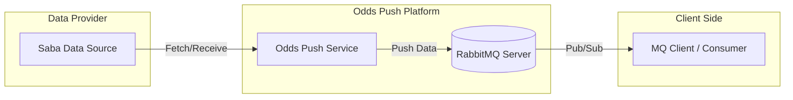
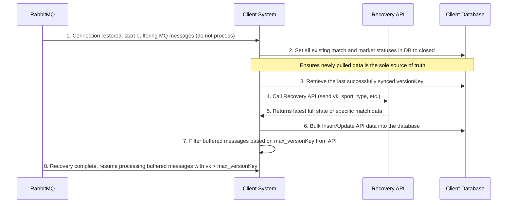

# 1. Introduction

## 1.1. Document Purpose

This document provides a comprehensive technical guide for service developers, explaining how to integrate and receive real-time sports events and odds data through the OddsPush platform.

1. **Real-time Push**: Based on the RabbitMQ publish/subscribe mechanism, ensuring receipt of event changes (e.g., scores, status) and odds updates with millisecond latency.
2. **Standardized Structure**: Detailed definition of core object structures to reduce guesswork during data parsing and business logic alignment.
3. **Reliable Integration**: Provides best practices for message ordering, version checking, and reconnection to ensure stable operation of downstream systems under high concurrency or network fluctuations.

## 1.2. System Overview



**Data Coverage**

* **Multiple Sports**: Soccer, Basketball, Tennis, E-Sports, etc.
* **Comprehensive Event Info**: Team basic data, kickoff time, real-time scores, red/yellow cards, etc.
* **Rich Market Types**: Handicap (HDP), Over/Under (OU), 1x2, Correct Score, etc.

# 2. Integration Guide

## 2.1 Protocol

### 2.1.1 Real-time Messaging

We use RabbitMQ as the message broker, distributing data based on the standard AMQP 0.9.1 protocol.

* **Transmission Framework**: Recommend using native RabbitMQ Client for integration.
* **Exchange Type**: Topic. This allows flexible filtering of data for specific events or sports via Routing Keys.
* **Exchange Name**: Provided separately.

### 2.1.2 Backup Channel (Recovery) RESTful API

Used only as a backup mechanism when RabbitMQ is unavailable. You can use the Recovery API to retrieve data that was missed from RabbitMQ.

### 2.1.3 Serialization

For efficiency and ease of development, the entire system uses JSON as the serialization format.

* **Encoding**: UTF-8.
* **Time Format**: ISO 8601 (e.g., `2023-10-27T10:00:00Z`), Timezone: GMT-4.
* **Numeric Handling**:
    * **Odds**: Transmit in Decimal format (precision to two decimal places).
    * **VersionKey**: Int64, used to determine message sequence/freshness.

## 2.2 Connection Details

### 2.2.1 Environment Endpoints

**RabbitMQ**

| Environment | RabbitMQ Host | Virtual Host | Credentials |
| :--- | :--- | :--- | :--- |
| Staging | Provided separately | Provided separately | Provided separately |

**RESTful API**

| Environment | Domain | VendorId |
| :--- | :--- | :--- |
| Staging | Provided separately | Provided separately |

### 2.2.2 Real-time Push (RabbitMQ) Configuration

OddsPush uses Topic Exchange mode. You must create your own Queue and bind it to the provided Exchange.

* **Exchange Name**: Provided separately
* **Exchange Type**: topic
* **Queue Naming**: Provided separately
* **Queue Configuration**：`durable: false, exclusive: true, autoDelete: true`
* **Routing Key Rules**:
  Hierarchical routing keys support on-demand subscription.
    * **Format**: `{"event"/"eventstate"/"market"/"heartbeat"}.{SportType}.{"live" or "nonlive"}.{EventID}`
    * **Examples**:
        * Subscribe to all Soccer events: `event.1.*.*`
        * Subscribe to score updates for a specific event: `eventstate.*.*.12345` (where 12345 is the EventID)
        * Subscribe to all odds updates: `market.*.*.*`
        * Subscribe to system heartbeats: `heartbeat`

### 2.2.3 Health Check

* **MQ Heartbeat**: System sends a heartbeat message to the `heartbeat` routing key every 60 seconds (1 minute).

## 2.3 Delivery Guarantees

To ensure critical odds and event data are not lost during network fluctuations or service downtime, OddsPush follows these delivery standards:
**At-Least-Once Delivery**: The system guarantees every generated message is successfully delivered at least once.

* **Mechanism**: Publisher Confirms are enabled to ensure messages reach the RabbitMQ Exchange before being marked as sent.

## 2.4 Message Ordering

OddsPush uses architectural design and data versioning to ensure downstream services process changes in the correct order.

### 2.4.1 Ordering Mechanism

OddsPush follows these principles when publishing:
**Per-Event Ordering**: The system guarantees all updates (status, score, odds) for a single "EventID" are published to RabbitMQ in the chronological order they were generated.

# 3. Core Message Envelope

## 3.1 Message Types

OddsPush deconstructs sports event changes into three core message types. Each type is identified by the `messageType` field and carries different business logic in the `data` object.

### 3.1.1 Event Basic Info (Event)

* **MessageType**: 0
    * **Triggers**:
        * New event created.
        * Event static data changed.
    * **Core Content**:
        * Unique identifier (`eventId`).
        * Team info (Names, IDs).
        * League info (Name, Logo URL).
        * `SportType` and kickoff time.

### 3.1.2 Event Dynamic State (EventState)

* **MessageType**: 1
    * **Triggers**:
        * Score change: Goals, points scored.
        * Period transition: Half-time ending, second half starting, full time.
    * **Core Content**:
        * Current total score and period-specific scores.
        * Match period codes.

### 3.1.3 Market & Odds Updates (Market)

* **MessageType**: 2
    * **Triggers**:
        * Odds fluctuation: Real-time adjustments based on play.
        * Line change: e.g., Handicap moves from 0.5 to 0.5/1.
        * Market status: Opening or closing specific markets (e.g., "Next Goal").
    * **Core Content**:
        * `EventId`.
        * `BetType` (Market type).
        * `Selections`: List containing IDs, odds, and points (Point).

# 4. Business Data Models

## 4.1 Event Model (OddsPushEvent)

`OddsPushEvent` carries static and basic info. Sent when a new event is established or basic details change.

### 4.1.1 JSON Example

```json
{
  "messageType": 0,
  "data": {
    "eventId": 123674997,
    "leagueId": 165,
    "sportType": 1,
    "homeTeamId": 682639,
    "awayTeamId": 6264,
    "leagueName": "TESTING (Betting Prohibited Area!!) - SOCCER",
    "homeTeamName": "Test 007",
    "awayTeamName": "Test A",
    "leagueLogoUrl": "https://cmbi.licimg.com/LeagueImg/l_165.png",
    "homeTeamLogoUrl": "https://cmbi.licimg.com/TeamImg/team_flag_home.png",
    "awayTeamLogoUrl": "https://cmbi.licimg.com/TeamImg/team_flag_away.png",
    "eventStatus": "running",
    "livePeriod": 0,
    "kickoffTime": "2026-03-13T03:09:00",
    "isNeutral": false,
    "injuryTime": 0,
    "isTest": true,
    "hasLive": true,
    "globalShowTime": "2026-03-13T03:10:00",
    "countryCode": "others",
    "delayLive": null,
    "gameStatus": null,
    "isBreak": null,
    "hasLiveParlay": false,
    "hasDeadBallParlay": false,
    "isVirtualEvent": false,
    "isCashOut": true,
    "channelCode": "CH_001",
    "isStartingSoon": false,
    "moveBO3Down": null,
    "overTimeSession": null,
    "leagueGroup": null,
    "leagueGroupID": null,
    "inPlayTime": "15:30",
    "homeTeamCountryCode": "TW",
    "awayTeamCountryCode": "US",
    "parentId": 0,
    "isHT": false,
    "isClosed": false,
    "gameSession": 2,
    "changeTime": "2026-03-13T03:16:36.72",
    "versionKey": 109523866999,
    "isLive": true,
    "streamingOption": 1,
    "streamingLinks": [
      {
        "provider": "SabaStream",
        "url": "https://stream.example.com/live/123674997",
        "language": "en"
      }
    ]
  }
}
```

### 4.1.2 Field Definitions

| Field | Type | Description |
| :--- | :--- | :--- |
| `data` | OddsPushEvent | Event model structure |
| `eventId` | Int64 | Unique match identifier |
| `leagueId` | Int | Unique league identifier |
| `sportType` | Int | Sport type code (e.g., 1 for Soccer) |
| `homeTeamId` | Int | Home team unique identifier |
| `awayTeamId` | Int | Away team unique identifier |
| `leagueName` | String | League name |
| `homeTeamName` | String | Home team name |
| `awayTeamName` | String | Away team name |
| `leagueLogoUrl` | String | League logo URL |
| `homeTeamLogoUrl` | String | Home team flag URL |
| `awayTeamLogoUrl` | String | Away team flag URL |
| `eventStatus` | String | Match status (e.g., "running") |
| `livePeriod` | Int | Period code |
| `kickoffTime` | String | Kick-off time |
| `isNeutral` | Bool | Is a neutral venue |
| `injuryTime` | Int | Stoppage/Injury time |
| `isTest` | Bool | Is test data |
| `hasLive` | Bool | Supports Live/In-play betting |
| `globalShowTime` | String | Visibility start time |
| `countryCode` | String | Alpha country code |
| `delayLive` | Bool | Is match delayed |
| `gameStatus` | Int | 1= PRC (Potential Red Card), 2= PPen (Potential Penalty), 3=VAR, 4=Penalty, 5=Injury, 6=Sudden Death |
| `isBreak` | Int | Is match paused |
| `hasLiveParlay` | Bool | Supports Live Parlay |
| `hasDeadBallParlay` | Bool | Supports DeadBall Parlay |
| `isVirtualEvent` | Bool | Is a virtual match |
| `isCashOut` | Bool | Supports Early Cash Out |
| `channelCode` | String | Streaming channel code |
| `isStartingSoon` | Bool | For E-Sports countdown |
| `moveBO3Down` | Bool | Control flag for displaying ESports banners |
| `overTimeSession` | Int | E-Sports game name: 1 = Dota2, 2 = LOL, 3 = CS2, 4 = KOG, 5 = LOL:Wild Rift, 7 = Arena of Valor, 8 = PUBG, 9 = Mobile Legends, 10 = Valorant, 11 = Overwatch, 12 = StarCraft 2, 13 = Warcraft 3, 14 = CrossFire, 15 = Rainbow Six, 16 = PUBG Mobile, 17 = Call of Duty, 97 = E-Sports, 98 = SABA E-Sports PinGoal, 99 = Others |
| `leagueGroup` | String | ESports league group name |
| `leagueGroupID` | Int | ESports league group ID |
| `inPlayTime` | String | Match clock (e.g., "15:30"). Applicable to SportType 1, 2, 3, 4, 134 |
| `homeTeamCountryCode` | String | Home team country code |
| `awayTeamCountryCode` | String | Away team country code |
| `parentId` | Int64 | Parent Event ID (used for linking markets) |
| `isHT` | Bool | Is Half-Time |
| `isClosed` | Bool | Is match closed |
| `gameSession` | Int | Section count |
| `changeTime` | String | Last update timestamp |
| `versionKey` | Int64 | Version control ID |
| `isLive` | Bool | Is a Live/Running match |
| `streamingOption` | Int | Streaming option code |
| `streamingLinks` | Array (Object) | List of available stream URLs |

#### streamingLink

| Field | Type | Description |
| :----------- | :------- | :------ |
| `provider` | String | Streaming provider |
| `url` | String | URL |
| `language` | String | Language |

## 4.2 State Model (OddsPushEventState)

`OddsPushEventState` carries dynamic progress info. Sent immediately when score changes or events occurs.

### 4.2.1 JSON Example

```json
{
  "messageType": 1,
  "data": {
    "eventId": 123679985,
    "sportType": 2,
    "marketType": "l",
    "eventStatus": "running",
    "liveHomeScore": 82,
    "liveAwayScore": 78,
    "homeRedCard": 0,
    "awayRedCard": 0,
    "homeYellowCard": 0,
    "awayYellowCard": 0,
    "isHT": false,
    "versionKey": 109530705897,
    "isClosed": false,
    "tennisHomeGameScore": null,
    "tennisAwayGameScore": null,
    "tennisHomePointScore": null,
    "tennisAwayPointScore": null,
    "tennisCurrentSet": null,
    "tennisCurrentServe": null,
    "hasLiveScore": true,
    "isBreak": false,
    "bestOfMap": null,
    "gameStatus": 1,
    "scoreData": {
      "TotalThreePointers": "12",
      "FreeThrowPercentage": "85%"
    },
    "timerSuspend": false,
    "gameRound": 1,
    "beachVolleyballData": null,
    "volleyBallLiveScore": null,
    "baseBallLiveScore": null,
    "footballLiveScore": null,
    "tableTennisLiveScore": null,
    "badmintonLiveScore": null,
    "basketBallLiveScore": {
      "a1q": "20",
      "a2q": "18",
      "a3q": "22",
      "a4q": "18",
      "h1q": "25",
      "h2q": "20",
      "h3q": "15",
      "h4q": "22",
      "llp": "4",
      "overTimeA": null,
      "overTimeH": null
    },
    "beachVolleyballHomeGameScore": null,
    "beachVolleyballAwayGameScore": null,
    "beachVolleyballCurrentSet": null,
    "beachVolleyballCurrentServe": null,
    "injury": 0,
    "rain": false,
    "inPlayTime": "3Q '1",
    "sessionTime": 525.0,
    "overTime": 0.0,
    "isCountDownTimer": true,
    "pausePeriod": 0,
    "liveTimer": "2026-03-13T05:12:54",
    "iceHockeyLiveScore": null
  }
}
```

### 4.2.2 Field Definitions

| Field | Type | Description |
| :--- | :--- | :--- |
| `data` | OddsPushEventState | State model structure |
| `eventId` | Int | Unique match ID |
| `sportType` | Int | Sport type code (e.g., 1 for Soccer) |
| `marketType` | String | Market type ("l": Live, "d": DeadBall) |
| `eventStatus` | String | Match status (e.g., "running") |
| `liveHomeScore` | Int | Current Home total score |
| `liveAwayScore` | Int | Current Away total score |
| `homeRedCard` | Int | Home red cards |
| `awayRedCard` | Int | Away red cards |
| `homeYellowCard` | Int | Home yellow cards |
| `awayYellowCard` | Int | Away yellow cards |
| `versionKey` | Int64 | Version ID |
| `tennisHomeGameScore` | Int[] | Tennis home games per set |
| `tennisAwayGameScore` | Int[] | Tennis away games per set |
| `tennisHomePointScore` | String | Tennis home point score |
| `tennisAwayPointScore` | String | Tennis away point score |
| `tennisCurrentSet` | Int | Current set index |
| `tennisCurrentServe` | Int | Server (1: Home, 2: Away) |
| `gameStatus` | Int | 1= PRC (Potential Red Card), 2= PPen (Potential Penalty), 3=VAR, 4=Penalty, 5=Injury, 6=Sudden Death |
| `timerSuspend` | Bool | Is match timer suspended |
| `volleyBallLiveScore` | Object | Volleyball live scores |
| `baseBallLiveScore` | Object | Baseball live scores |
| `footballLiveScore` | Object | American Football live scores |
| `tableTennisLiveScore` | Object | Table Tennis live scores |
| `badmintonLiveScore` | Object | Badminton live scores |
| `basketBallLiveScore` | Object | Basketball detailed period scores |
| `beachVolleyballHomeGameScore` | Int[] | Beach Volleyball home games per set |
| `beachVolleyballAwayGameScore` | Int[] | Beach Volleyball away games per set |
| `beachVolleyballCurrentSet` | Int | Beach Volleyball current set |
| `beachVolleyballCurrentServe` | Int | Beach Volleyball current serve |
| `injury` | Int | Player injury: 0=None, 1=Home, 2=Away, 3=Both |
| `rain` | Bool | Is raining (Applicable to Beach Volleyball) |
| `inPlayTime` | String | Readable match clock (e.g., "3Q '1") |
| `sessionTime` | Double | Section duration |
| `overTime` | Double | Overtime duration |
| `isCountDownTimer` | Bool | Is in countdown mode |
| `pausePeriod` | Int | Pause status |
| `liveTimer` | DateTime | Reference for real-time clock |
| `iceHockeyLiveScore` | Object | Ice Hockey live scores |

#### VolleyBallLiveScore

| Field | Type | Description |
| :------ | :----- | :------------------------------------ |
| `A1S` | Int | Away team Set 1 score |
| `A2S` | Int | Away team Set 2 score |
| `A3S` | Int | Away team Set 3 score |
| `A4S` | Int | Away team Set 4 score |
| `A5S` | Int | Away team Set 5 score |
| `APT` | Int | Away team current points in set |
| `AS` | Int | Away team total score |
| `H1S` | Int | Home team Set 1 score |
| `H2S` | Int | Home team Set 2 score |
| `H3S` | Int | Home team Set 3 score |
| `H4S` | Int | Home team Set 4 score |
| `H5S` | Int | Home team Set 5 score |
| `HPT` | Int | Home team current points in set |
| `HS` | Int | Home team total score |
| `INJ` | Int | Injury: 0=None, 1=Home, 2=Away, 3=Both |
| `SER` | Int | Server (1: Home, 2: Away) |
| `LLP` | Int | Live Logical Period |

#### BaseBallLiveScore

| Field | Type | Description |
| :------ | :----- | :------------------------ |
| `B1` | Bool | Runner on 1st base |
| `B2` | Bool | Runner on 2nd base |
| `B3` | Bool | Runner on 3rd base |
| `A1R` | Int | Away team Inning 1 score |
| `A2R` | Int | Away team Inning 2 score |
| `A3R` | Int | Away team Inning 3 score |
| `A4R` | Int | Away team Inning 4 score |
| `A5R` | Int | Away team Inning 5 score |
| `A6R` | Int | Away team Inning 6 score |
| `A7R` | Int | Away team Inning 7 score |
| `A8R` | Int | Away team Inning 8 score |
| `A9R` | Int | Away team Inning 9 score |
| `AOT` | Int | Away Overtime score |
| `BAT` | Int | Batter (1: Home, 2: Away) |
| `H1R` | Int | Home team Inning 1 score |
| `H2R` | Int | Home team Inning 2 score |
| `H3R` | Int | Home team Inning 3 score |
| `H4R` | Int | Home team Inning 4 score |
| `H5R` | Int | Home team Inning 5 score |
| `H6R` | Int | Home team Inning 6 score |
| `H7R` | Int | Home team Inning 7 score |
| `H8R` | Int | Home team Inning 8 score |
| `H9R` | Int | Home team Inning 9 score |
| `HOT` | Int | Home Overtime score |
| `INN` | Int | Current Inning |
| `OUT` | Int | Current Outs |

#### American FootballLiveScore

| Field | Type | Description |
| :------ | :----- | :---------- |
| `A1Q` | Int | Away team Quarter 1 score |
| `A2Q` | Int | Away team Quarter 2 score |
| `A3Q` | Int | Away team Quarter 3 score |
| `A4Q` | Int | Away team Quarter 4 score |
| `AOT` | Int | Away Overtime score |
| `APT` | Int | Away current total points |
| `H1Q` | Int | Home team Quarter 1 score |
| `H2Q` | Int | Home team Quarter 2 score |
| `H3Q` | Int | Home team Quarter 3 score |
| `H4Q` | Int | Home team Quarter 4 score |
| `HOT` | Int | Home Overtime score |
| `HPT` | Int | Home current total points |

#### TableTennisLiveScore

| Field | Type | Description |
| :---------------- | :---------- | :------------ |
| `HomePoint` | Int | Home team current set point score |
| `AwayPoint` | Int | Away team current set point score |
| `HomeSetScore` | Int | Home team sets won |
| `AwaySetScore` | Int | Away team sets won |
| `HomeGameScore` | List<int> | Home team points record per set |
| `AwayGameScore` | List<int> | Away team points record per set |

#### BadmintonLiveScore

| Field | Type | Description |
| :---------------- | :---------- | :------------ |
| `HomePoint` | Int | Home team current set point score |
| `AwayPoint` | Int | Away team current set point score |
| `HomeSetScore` | Int | Home team sets won |
| `AwaySetScore` | Int | Away team sets won |
| `HomeGameScore` | List<int> | Home team points record per set |
| `AwayGameScore` | List<int> | Away team points record per set |

#### BasketBallLiveScore

| Field | Type | Description |
| :------------ | :------- | :--------- |
| `A1Q` | String | Away team Quarter 1 score |
| `A2Q` | String | Away team Quarter 2 score |
| `A3Q` | String | Away team Quarter 3 score |
| `A4Q` | String | Away team Quarter 4 score |
| `H1Q` | String | Home team Quarter 1 score |
| `H2Q` | String | Home team Quarter 2 score |
| `H3Q` | String | Home team Quarter 3 score |
| `H4Q` | String | Home team Quarter 4 score |
| `LLP` | String | Current period |
| `OverTimeA` | String | Away Overtime score |
| `OverTimeH` | String | Home Overtime score |

#### IceHockeyLiveScore

| Field | Type | Description |
| :-------------------- | :---------- | :---------------- |
| `HomeScore` | List<int> | Home team score array per period |
| `AwayScore` | List<int> | Away team score array per period |
| `HomeOverTimeScore` | Int | Home Overtime score |
| `AwayOverTimeScore` | Int | Away Overtime score |
| `PowerPlay` | Int | Power play (1: Home, 2: Away) |
| `HomePowerPlay` | Int | Home power play strength |
| `AwayPowerPlay` | Int | Away power play strength |
| `Interrupted` | Int | 0 = Normal, 1 = Interrupted |
| `CurrentServe` | Int | Current possession (1: Home, 2: Away) |
| `HomePoint` | Int | Home team current score |
| `AwayPoint` | Int | Away team current score |

## 4.3 Market Model (OddsPushMarket)

### 4.3.1 JSON Example

```json
{
  "messageType": 2,
  "data": {
    "eventId": 122563022,
    "sportType": 1,
    "marketType": "d",
    "markets": [
      {
        "eventId": 122563022,
        "betType": 3,
        "marketID": 957146171,
        "marketCode": 1000.0,
        "changeTime": "2026-03-12T14:15:12.627",
        "isLive": false,
        "marketStatus": "running",
        "selections": [
          {
            "price": 0.91,
            "allPrice": {
              "parlayPrice": 1.91,
              "malayPrice": 0.91,
              "decimalPrice": 1.91,
              "hongKongPrice": 0.91,
              "indoPrice": -1.09,
              "americanPrice": -109.0
            },
            "key": "h",
            "point": 2.5,
            "point2": null
          },
          {
            "price": 0.83,
            "allPrice": {
              "parlayPrice": 1.83,
              "malayPrice": 0.83,
              "decimalPrice": 1.83,
              "hongKongPrice": 0.83,
              "indoPrice": -1.2,
              "americanPrice": -120.0
            },
            "key": "a",
            "point": 2.5,
            "point2": null
          }
        ],
        "resourceid": "01",
        "category": 0,
        "showCategory": "0",
        "sort": 1,
        "combo": 0,
        "versionKey": 109454399561
      }
    ]
  }
}
 ```

### 4.3.2 Field Definitions

| Field | Type | Description |
| :------------- | :------- | :---------------------------- |
| `data` | OddsPushMarket | Market data structure |
| `eventId` | Int64 | Unique match identifier |
| `sportType` | Int | Sport code |
| `marketType` | String | Market category (e.g., "d": DeadBall) |
| `markets` | Array | List of available markets |

#### Markets

| Field | Type | Description |
| :--------------- | :--------- | :------------------------------------------------------------------------------------------------------------------------------------------------------------------------------- |
| `betType` | Int | Bet type code (e.g., 3 for Over/Under) |
| `marketID` | Int | Unique market identifier |
| `changeTime` | DateTime | Last market change time |
| `isLive` | Bool | Is in-play/live |
| `marketStatus` | String | "running", "suspended", "closed" |
| `selections` | Array | Individual selection data |
| `resourceid` | String | Resource identifier |
| `category` | Int | 0: None, 1: FullTime, 2: Half, 3: Corners, 4: Intervals, 5: Specials, 6: Players, 7: FastMarket, 8: Quarter, 9: ExtraTime, 10: Penalty, 11-40: ESports Maps 1-30, 41: Ending Game |
| `showCategory` | String | Display grouping code |
| `sort` | Int | Display sort weight |
| `combo` | Int | Number of combo bets |
| `versionKey` | Int64 | Version identifier |

#### Selection

| Field | Type | Description |
| :------------ | :--------- | :----------------------------------------------------------------------------------------------------------------- |
| `price` | Decimal | Original odds |
| `allPrice` | Object | Object containing odds in various formats |
| `key` | String | Selection identifier (e.g., `h` for Home, `a` for Away, `d` for Draw) |
| `point` | Decimal | Primary handicap or over/under value (e.g., 2.5) |
| `point2` | Decimal | Secondary handicap or over/under value |

##### AllPrice

| Field | Type | Description |
| :------------------ | :--------- | :------------------------------------------------------------------------------- |
| `parlayPrice` | Decimal | Parlay odds (Decimal/Euro format) |
| `malayPrice` | Decimal | Malay odds |
| `decimalPrice` | Decimal | Decimal (Euro) odds |
| `hongKongPrice` | Decimal | Hong Kong odds |
| `indoPrice` | Decimal | Indo odds |
| `americanPrice` | Decimal | American odds |

# 5. Recovery API (RESTful)
When RabbitMQ push is interrupted, the version lags, or a full synchronization is required upon restart, proactive recovery can be performed via the following RESTful APIs. The entire system follows a 10-times-per-minute frequency limit.

## 5.1 Recovery Scenarios

### 5.1.1 Full Synchronization (Full Sync)
* System initialization and startup.
* Network issues, system reboot, or routine maintenance causing MQ disconnection for over 5 minutes.

### 5.1.2 Specific Match Recovery (Recovery by Match / Event)
Applicable to the following specific scenarios:
1. **Single Event Abnormality**: When a specific event's `versionKey` has a gap that cannot be filled by subsequent pushes.
2. **Client Data Validation Failure**: Logic inconsistency between local data and pushed data (e.g., abnormal score regression or contradicting status).
3. **Specific Event Patching**: Upon receiving notifications from the OddsPush management side regarding specific event operation anomalies or manual corrections.

## 5.2 Recovery Standard Operating Procedure (SOP)

To ensure data consistency, clients should strictly follow these steps when performing a recovery:



## 5.3 RecoverEvents
Used to recover basic match information.
* **Endpoint**: `/api/push/RecoverEvents`
* **Method**: `POST`
* **Request Format**: `multipart/form-data`
* **Request Parameters**:

| Field | Type | Required | Notes |
| :--- | :--- | :--- | :--- |
| `sport_type` | Int | Yes | Sport code (e.g., 1: Soccer) |
| `market_type`| String | Yes | Market class (d: DeadBall, l: Live) |
| `version_key`| Int64 | Yes | Starting version Key for recovery |
| `event_Ids` | Int[] | No | Specific event ID list |
| `vendor_id` | String | Yes | Provided separately |

* **Response**:
  * Returns `List<OddsPushEvents>`. For detailed structure and JSON example, please refer to [4.1.1 JSON Example](#411-json-example).

## 5.3 RecoverEventStates
Used to recover scores and match period status information.
* **Endpoint**: `/api/push/RecoverEventStates`
* **Method**: `POST`
* **Request Format**: `multipart/form-data`
* **Request Parameters**:

| Field | Type | Required | Notes |
| :--- | :--- | :--- | :--- |
| `sport_type` | Int | Yes | Sport code |
| `market_type`| String | Yes | Market class |
| `version_key`| Int64 | Yes | Starting version Key |
| `event_Ids` | Int[] | No | Specific event ID list |
| `vendor_id` | String | Yes | Provided separately |

* **Response**:
  * Returns `List<OddsPushEventStates>`. For detailed structure and JSON example, please refer to [4.2.1 JSON Example](#421-json-example).

## 5.4 RecoverMarkets
Used to recover market and odds information.
* **Endpoint**: `/api/push/RecoverMarkets`
* **Method**: `POST`
* **Request Format**: `multipart/form-data`
* **Request Parameters**:

| Field | Type | Required | Notes |
| :--- | :--- | :--- | :--- |
| `sport_type` | Int | Yes | Sport code |
| `market_type`| String | Yes | Market class |
| `bet_type` | String | No | Specific bet type code (e.g., "1") |
| `version_key`| Int64 | Yes | Starting version Key |
| `event_Ids` | Int[] | No | Specific event ID list |
| `vendor_id` | String | Yes | Provided separately |

* **Response**:
  * Returns `OddsPushMarkets`. For detailed structure and JSON example, please refer to [4.3.1 JSON Example](#431-json-example).
